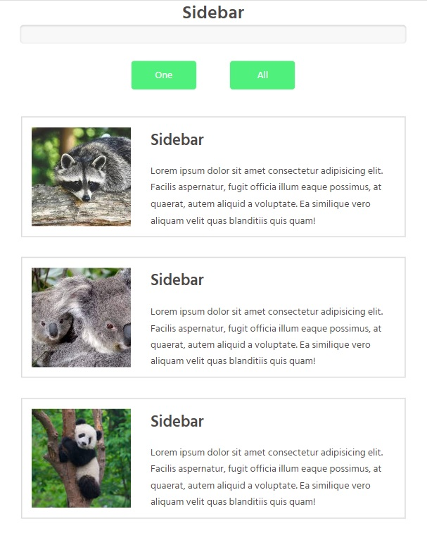
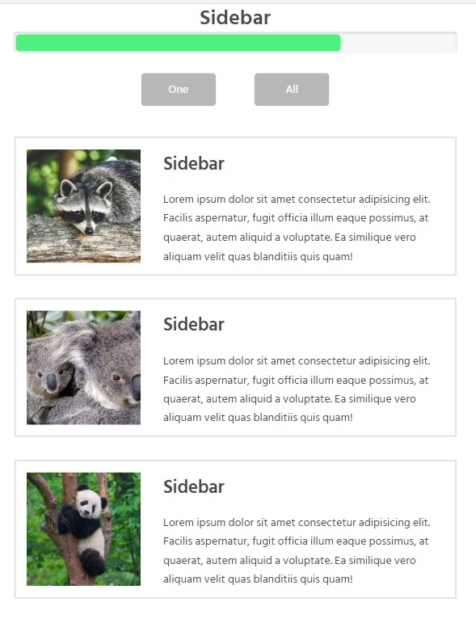

# sidebar
SideBar
One page application with preloader, two buttons and three booxes.
Clinking on button "One", buttons become deasabled, the preloader is launched, filled up to 100% and starting close the elements in the blocks.
First is closed the image, than header, text and wrapper for the first block, then sequentially for the second block and the last for the third block.
When all three blocks are hidden, the preloader drops to 0 and the blocks become visible.
Clicking on button "All", buttons become deasabled, the preloader is launched, filled up to 100% and starting close the elements in the all blocks.
First are closed all images, than headers, texts and wrappers.
When all three blocks are hidden, the preloader drops to 0 and the blocks become visible.

Technologies used:

Html
Scss
JavaScript
Promises
Async/await syntax

SetUp/Installation instructions:

Clone this repository to your desktop
open index.html
push 'Open with Live Server'
